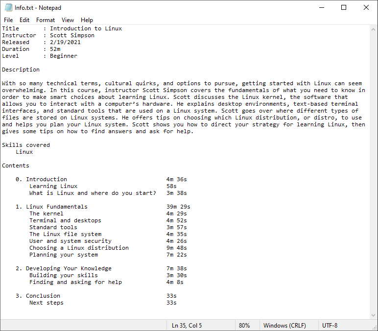
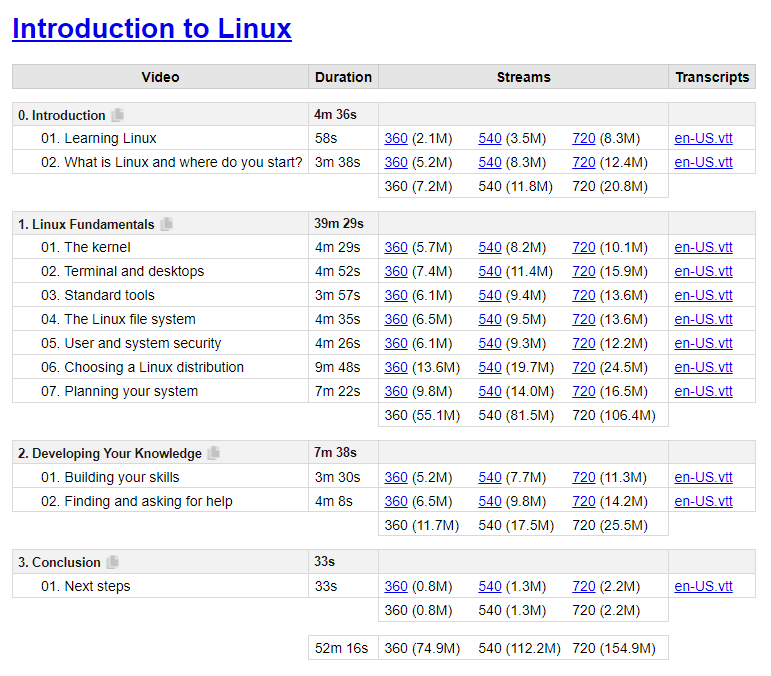

# LinkedIn Learning Video Downloader

I like to keep local copies of the courses that I watch on LinkedIn Learning.

I usually use the tool [knowbee/llvd](https://github.com/knowbee/llvd) to do this, but sometimes it fails. It's too focused on the end result, that is downloading the videos.

I'll be taking a more layered approach to automating this process. So a fail at some layer shouldn't affect the end goal. If one is able to watch the videos, then one should be able to download them no matter what. A failure in the tool shouldn't prevent this.

## Layers

### 1. Download Links

Normally, one should be able to directly download the videos on LinkedIn Learning (or anywhere). However, this is not allowed for whatever (business) reasons.

Well, on the internet, nothing is unreachable. If one is able to view the video, one can also download it.

So, the first thing to do is to find these download links, and provide the user a way to download the videos.

## Output

`get-course-info.py` produces the `Info.txt` file:

`get-course-links.py` produces the `Links.html` file:

